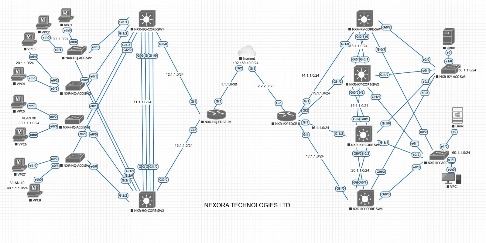

# Dual-Site Enterprise Network — Nexora Technologies Ltd

> A production-grade enterprise network connecting Lagos HQ and Ikeja Branch, 
> built in EVE-NG using Cisco IOS and IOS-XE devices.

---

## Overview

Designed and implemented a complete dual-site enterprise network for a fictional 
fintech company, Nexora Technologies Ltd. The network supports six departments 
across two offices, connected via an encrypted site-to-site VPN with full 
redundancy at every layer.

This project covers the full deployment lifecycle — design, implementation, 
troubleshooting, hardening, and documentation.

---

## Network Diagram



---

## What Was Built

| Feature | Technology | Detail |
|---|---|---|
| Site-to-site VPN | IPsec over GRE | AES-256 encryption, SHA-256 integrity |
| Internal routing | OSPF Area 0 | Both sites, passive SVIs |
| Inter-site routing | EIGRP over tunnel | Redistribution at edge routers |
| Gateway redundancy | HSRP | Priorities aligned with STP root |
| Loop prevention | STP PVST+ | Root bridge intentionally placed |
| Link redundancy | EtherChannel | LACP/PAGP across core switches |
| Internet access | NAT overload | IP SLA tracked default route |
| Access hardening | PortFast + BPDU Guard | All access-facing ports |
| Time sync | NTP hierarchy | ISP → Edge → Core → Access |
| Centralised logging | Syslog | All 15 devices → Linux server |
| Device hardening | SSH v2, exec-timeout, banner | Consistent baseline all devices |

---

## Sites and VLANs

### Lagos HQ
| VLAN | Subnet | Department |
|---|---|---|
| 10 | 10.1.1.0/24 | Finance and Accounts |
| 20 | 20.1.1.0/24 | Engineering and Development |
| 30 | 30.1.1.0/24 | Sales and Business Development |
| 40 | 40.1.1.0/24 | Management and Executive |

### Ikeja Branch
| VLAN | Subnet | Department |
|---|---|---|
| 50 | 50.1.1.0/24 | IT Infrastructure and Operations |
| 60 | 60.1.1.0/24 | Customer Support and Service Desk |

---

## Device Inventory

| Device | Role | Platform |
|---|---|---|
| ISP-TRANSIT-R1 | Simulated ISP | Cisco CSR1000V IOS-XE 17.3 |
| NXR-HQ-EDGE-R1 | HQ edge router | Cisco CSR1000V IOS-XE 17.3 |
| NXR-HQ-CORE-SW1/2 | HQ core/distribution | Cisco IOSv 15.2 |
| NXR-HQ-ACC-SW1-4 | HQ access switches | Cisco IOSv 15.2 |
| NXR-IKY-EDGE-R1 | IKY edge router | Cisco CSR1000V IOS-XE 17.3 |
| NXR-IKY-CORE-SW1-4 | IKY core/distribution | Cisco IOSv 15.2 |
| NXR-IKY-ACC-SW1/2 | IKY access switches | Cisco IOSv 15.2 |

---

## Key Troubleshooting Lessons

**NAT conflicting with IPsec** — NAT was translating IKE packets on UDP 500 before 
IPsec could process them. Fixed by adding an explicit deny for tunnel endpoint IPs 
in the NAT ACL before the permit any statement.

**OSPF default route not propagating to IKY** — Missing `default-information originate` 
on IKY edge router caused all core switches to have no gateway of last resort.

**Stacked NAT rules** — Adding a new NAT ACL without removing the old one caused both 
to run simultaneously. IOS stacks NAT rules — explicit removal is required.

**HSRP and STP misalignment** — Without deliberate configuration, HSRP and STP elect 
independently, frequently placing the active gateway on a different switch from the 
STP root. Traffic bounces unnecessarily. Fixed by manually setting priorities on both 
to match.

---

## Repository Structure
```
├── README.md
├── configs/
│   ├── ISP-TRANSIT-R1.txt
│   ├── NXR-HQ-EDGE-R1.txt
│   ├── NXR-HQ-CORE-SW1.txt
│   ├── NXR-HQ-CORE-SW2.txt
│   ├── NXR-HQ-ACC-SW1.txt
│   ├── NXR-HQ-ACC-SW2.txt
│   ├── NXR-HQ-ACC-SW3.txt
│   ├── NXR-HQ-ACC-SW4.txt
│   ├── NXR-IKY-EDGE-R1.txt
│   ├── NXR-IKY-CORE-SW1.txt
│   ├── NXR-IKY-CORE-SW2.txt
│   ├── NXR-IKY-CORE-SW3.txt
│   ├── NXR-IKY-CORE-SW4.txt
│   ├── NXR-IKY-ACC-SW1.txt
│   └── NXR-IKY-ACC-SW2.txt
└── docs/
    ├── topology.png
    └── Nexora_Network_Documentation.docx
```

---

## Skills Demonstrated

- Enterprise network design and hierarchical architecture
- Multi-protocol routing with OSPF, EIGRP and route redistribution
- Site-to-site VPN with IPsec over GRE
- Layer 2 and Layer 3 redundancy design and alignment
- Network security hardening and access control
- Centralised monitoring with Syslog and NTP
- Systematic troubleshooting methodology
- Professional network documentation

---

## Certifications

- Cisco Certified Network Associate (CCNA)
- AWS Certified Cloud Practitioner (AWS CP)

---

*Simulated in EVE-NG | Cisco IOS 15.2 and IOS-XE 17.3 | March 2026*
